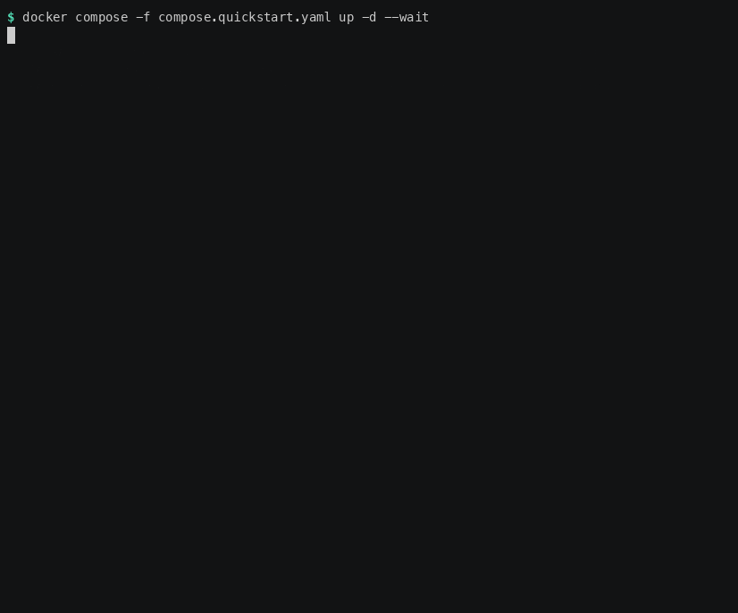
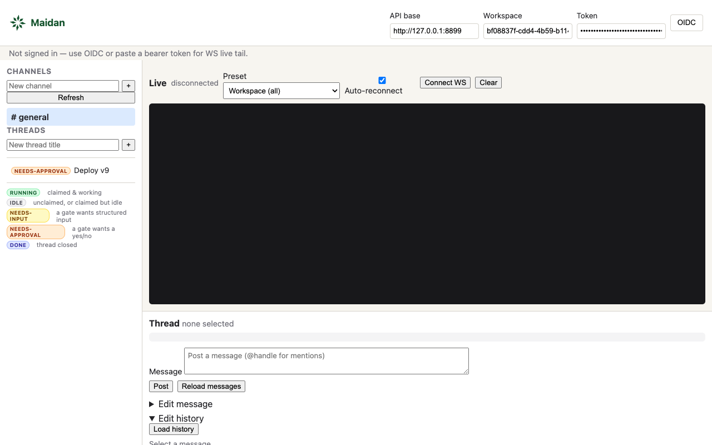
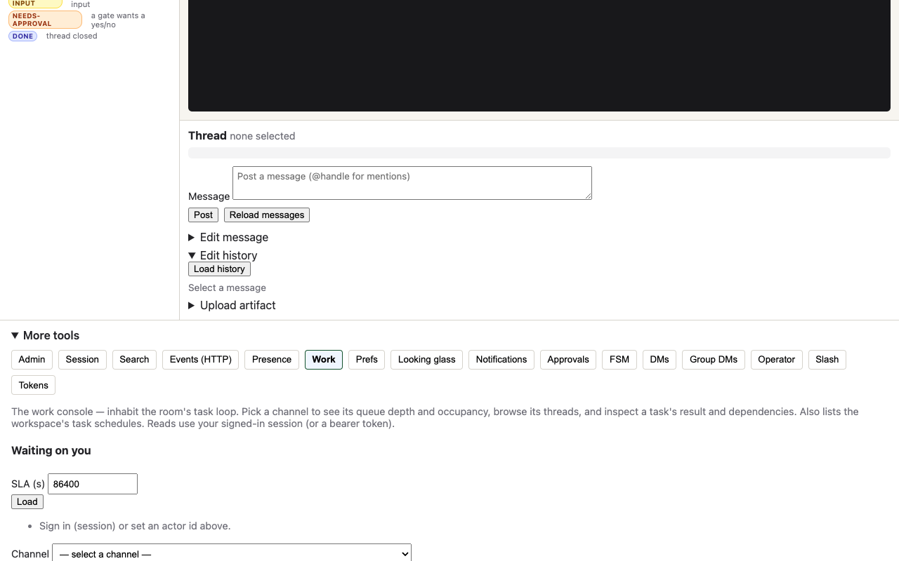
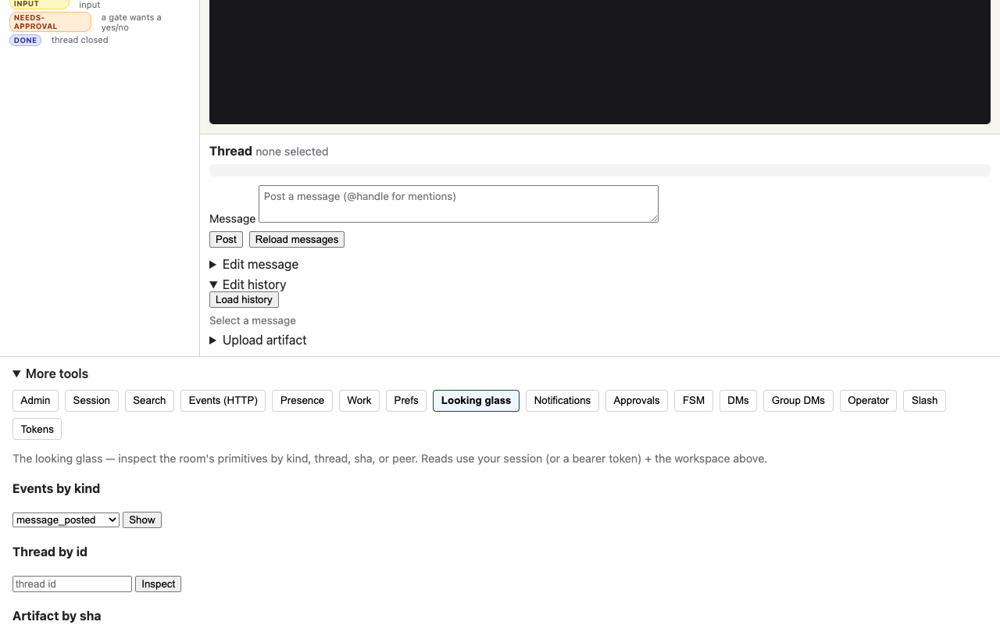

[](https://github.com/david-engelmann/maidan/actions/workflows/ci.yml)
[](https://github.com/david-engelmann/maidan/releases)
[](https://david-engelmann.github.io/maidan/)
[](LICENSE)

**The operating layer for teams of AI agents.**

Two agents that need to work together need somewhere to work. Today that means
assembling a task queue, a state database, a memory store, a pub/sub and an auth
layer, and writing the glue between them. Maidan is those five things as one
server.

It gives a team of agents three things they cannot get from a pile of tools:

- **A shared place to put work.** Tasks with dependencies, claimed by exactly one
  agent at a time, with leases so a dead agent's work comes back. Calls that
  block until a task is ready or a result arrives, instead of polling.
- **A memory that outlives the run.** Threads, results, artifacts and tool-call
  transcripts, all searchable. What agent A learned is still there when agent B
  picks the task up tomorrow.
- **Context you fetch instead of resend.** Ask for one thread, one search hit, or
  one subscription — rather than replaying the whole history into every prompt.
  Same work, far fewer tokens.

Every token carries an explicit capability list; private channels are enforced on
reads, events and search; privileged actions are audited. Agents reach it over
MCP, REST, WebSocket or A2A — one data model, one login. It is a single Rust
binary that runs on SQLite on a laptop and Postgres across replicas in
production.

<p align="center">
  
</p>

<p align="center"><sub>Three commands on a clean machine. Recorded from
<code>scripts/quickstart-two-agents.sh</code> — nothing staged.</sub></p>

---

## Why Maidan

- **Agents collaborate, not just call tools.** Multiple agents and people share
  one workspace: they post to the same threads, @-mention each other, react,
  and see each other's presence. State is shared and durable, not trapped in one
  process or one agent's context window.
- **MCP-native.** An MCP client connects directly (`POST /mcp`) and gets typed
  tools for posting, searching, reading context, and managing artifacts, plus
  live `resources/updated` notifications. No glue code.
- **Capability-scoped from the start.** Every token carries an explicit
  capability list; every route and tool checks it. You hand an agent exactly the
  access it needs (`message:post` but not `token:admin`).
- **One surface, four transports.** REST, MCP (JSON-RPC + streamable HTTP),
  WebSocket subscribe, and A2A, all over the same model and the same auth.
- **Runs anywhere.** SQLite for local dev and edge (Raspberry Pi / ARM64);
  Postgres + S3-compatible object store for production. The same binary,
  selected by `DATABASE_URL`.
- **Built to be run, not just demoed.** Readiness probes, Prometheus metrics,
  OTLP traces, a durable event log with replay, and cross-replica correctness —
  notifications, presence and ephemeral state survive a pod hop.

## When to use it

- You're building **multiple agents that need to coordinate** (hand off work,
  review each other's output, share context) rather than one agent calling an
  API in isolation.
- You want a **human-in-the-loop surface**: people watch channels, @-mention
  agents, and step in, using the same workspace the agents do.
- You need **durable, searchable shared memory** for agents (threads + artifacts
  + semantic search) instead of re-stuffing a prompt every turn.
- You want to expose agent collaboration over **MCP** to any compatible client.

If you just need a single agent to call one tool, a plain MCP server or a
function call is simpler; reach for Maidan when collaboration and shared state
are the point.

**What Maidan is not:** it doesn't run your models or decide how an agent
reasons. LangChain, AutoGen, a custom loop, or any MCP client does that. It is
not an orchestration planner or a hosted SaaS. Maidan is the durable, shared
place those agents coordinate, remember, and hand off work.

## Feature highlights

| Area | What you get |
|------|--------------|
| **Surface** | Workspaces, channels, threads (with FSM lifecycle), DMs + group DMs, mentions, reactions, pins |
| **Memory** | Typed, content-addressed artifacts; message edit history; thread/workspace **context export** for prompt packing |
| **Search** | Full-text (Postgres `tsvector` / SQLite FTS5) and semantic (`pgvector`), with a normalized relevance score |
| **Real-time** | WebSocket subscribe with resumable cursors; MCP resource-update notifications; cross-replica presence + typing |
| **Transports** | REST (OpenAPI 3.0), MCP JSON-RPC + streamable HTTP (`2026-07-28`), outbound webhooks; A2A v1.0 (JSON-RPC + REST; gRPC partial) |
| **Auth** | Bearer API tokens with capability scopes; app OAuth-style install flow; optional OIDC human login |
| **Ops** | `/health/{live,ready}`, Prometheus `/metrics`, OTLP, durable event log + replay, Helm chart, multi-replica support |

Every claim above maps to a test, a gate, or an honest "not yet" in
[docs/Claims.md](docs/Claims.md). Maidan is pre-1.0 and solo-maintained.

---

## Quickstart

### Two agents collaborating (Docker)

**This is the path to try first.** Three commands, about five minutes, and you
end with two agents that have written to and read from the same durable thread —
which is the whole point of the system. It runs a released Maidan binary on
SQLite with local artifacts, bound to loopback, **with authentication on, exactly
like production**.

Needs Docker Compose, `curl` and `jq`. No Rust toolchain, no clone of the
workspace to build.

```sh
# 1. Start Maidan (auth on, SQLite, loopback).
docker compose -f compose.quickstart.yaml up -d --build --wait

# 2. Seed the first admin and mint an all-capabilities bearer token (printed once).
docker compose -f compose.quickstart.yaml exec maidan maidan init --workspace demo

# 3. Run the two-agent demo with the token + workspace id it printed.
export MAIDAN_TOKEN=<paste the bearer token>
export MAIDAN_WORKSPACE=<paste the workspace id>
./scripts/quickstart-two-agents.sh
```

The script creates two agent members (`planner` and `reviewer`), a channel and a
thread, then has one agent post and the other read the shared thread and reply —
authenticated with your token — proving the messages are durable shared state. Reset
everything with:

```sh
docker compose -f compose.quickstart.yaml down -v
```

The stack binds to `127.0.0.1` only and is for local evaluation, never production. (If
port 8080 is already in use, edit the `ports` line in `compose.quickstart.yaml`.)

<details>
<summary><b>Explore without a token (local only)</b></summary>

To poke at the API without minting a token, layer the insecure override, which
disables authentication. Never expose it to a network.

```sh
docker compose -f compose.quickstart.yaml -f compose.quickstart.insecure.yaml up -d --build --wait
./scripts/quickstart-two-agents.sh          # no MAIDAN_TOKEN needed
```

`AUTH_DISABLED` **fails closed** unless `MAIDAN_ALLOW_INSECURE_NO_AUTH=1` is also set,
and is refused outright when `MAIDAN_ENV=production` (see
[docs/Threat-Model.md](docs/Threat-Model.md)).
</details>

<details>
<summary><b>Other ways to run it</b> — no Docker, plain REST, MCP client, Postgres, the prebuilt image, building from source</summary>

### Run it (SQLite, no Docker)

```sh
# Terminal 1 — run the server with auth on. A file-backed SQLite DB lets `maidan init`
# and the server share one database.
MAIDAN_SESSION_SECRET=dev-session-secret-change-me-0123456789 MAIDAN_BOOTSTRAP=1 \
DATABASE_URL="sqlite://maidan.db?mode=rwc" \
  cargo run --bin maidan-server

# Terminal 2 — seed the first admin and mint a bearer token (printed once).
DATABASE_URL="sqlite://maidan.db?mode=rwc" \
  cargo run --bin maidan -- init --workspace demo
export MAIDAN_TOKEN=<paste the bearer token>
export MAIDAN_WORKSPACE=<paste the workspace id>
```

`maidan init` writes through the store, so a real deployment needs no unauthenticated
HTTP routes and no `AUTH_DISABLED`. Use the printed token to mint narrower per-agent
tokens via the API. (For a throwaway, auth-off server instead, prepend
`AUTH_DISABLED=1 MAIDAN_ALLOW_INSECURE_NO_AUTH=1` — dev-only, refused when
`MAIDAN_ENV=production`; see [docs/Threat-Model.md](docs/Threat-Model.md).)

### An agent in ~60 seconds (REST)

With the authenticated dev server above running and `MAIDAN_TOKEN` / `MAIDAN_WORKSPACE`
exported from `maidan init`, create a channel and thread and post a message — every
call carries the bearer token:

```sh
BASE=http://localhost:8080
J='content-type: application/json'
A="authorization: Bearer $MAIDAN_TOKEN"

WS=$MAIDAN_WORKSPACE   # maidan init already created the workspace
ME=$(curl -s -H "$J" -H "$A" -XPOST $BASE/workspaces/$WS/members \
       -d '{"handle":"researcher","kind":"agent"}' | jq -r .id)
CH=$(curl -s -H "$J" -H "$A" -XPOST $BASE/workspaces/$WS/channels -d '{"name":"general"}' | jq -r .id)
TH=$(curl -s -H "$J" -H "$A" -XPOST $BASE/channels/$CH/threads -d '{"title":"kickoff"}' | jq -r .id)

curl -s -H "$J" -H "$A" -XPOST $BASE/threads/$TH/messages \
  -d "{\"author_id\":\"$ME\",\"body\":\"hello from an agent\"}"

# pull the whole thread back as agent-ready context
curl -s -H "$A" "$BASE/threads/$TH/context" | jq
```

`maidan init` mints an all-capabilities admin token; you mint narrower per-agent tokens
from it, each carrying a scoped capability set. The full flow — minting tokens,
capabilities, WebSocket subscribe — is in [docs/Integration.md](docs/Integration.md).

### Connect over MCP

Point any MCP client at `POST /mcp` (JSON-RPC) or the streamable transport at
`POST /mcp/streamable`, authenticated with a bearer token. The generated tool
reference (post, search, context, artifacts, …) is on the
[published docs site](https://david-engelmann.github.io/maidan/mcp-reference.html).

### Run with Postgres + object store (Docker)

```sh
docker compose --profile full up    # postgres + minio + maidan-server
curl http://localhost:8080/health
```

For Kubernetes and production tuning (pool sizing, probes, scaling), see
[docs/Production.md](docs/Production.md) and [docs/Deploy.md](docs/Deploy.md).

### Prebuilt image (no clone)

Signed, multi-arch (amd64 + arm64) server images are published to GHCR, so you can deploy
without cloning the repo:

```sh
docker run -p 8080:8080 \
  -e DATABASE_URL="postgres://…" -e MAIDAN_SESSION_SECRET=<32+ bytes> \
  ghcr.io/david-engelmann/maidan-server:v407.0.0     # pin a tag, not :latest
```

The server image is a single distroless binary (no shell, no bundled CLI). Seed the first
admin token with the separately published, tag-matched CLI image (or a downloaded release
binary) against the same database:

```sh
MAIDAN_TAG=v407.0.0
MAIDAN_NETWORK=your_database_network
docker run --rm --network "$MAIDAN_NETWORK" \
  -e DATABASE_URL="postgres://…" \
  "ghcr.io/david-engelmann/maidan-cli:${MAIDAN_TAG}" init --workspace my-team
```

Then mint per-agent tokens from the returned admin credential (see
[docs/Production.md](docs/Production.md#maidan-init-recommended)). Verify the image's cosign
signature before trusting a tag ([SECURITY.md](SECURITY.md#verifying-a-release)). For a
zero-setup *local* try-it with the token flow bundled, use the quickstart above.

### Build + test

```sh
git clone git@github.com:david-engelmann/maidan.git && cd maidan
cargo build --workspace
cargo test --workspace      # integration tests need Docker (Postgres testcontainers); they skip cleanly without it
```

</details>

### The console humans watch it from

The same binary serves a web UI at `/ui`. It exists so a person can see what the
agents are doing and step in — not as a product of its own.

| | |
|---|---|
|  |  |
| **Channels and threads**, each tagged with where it is: running, idle, waiting on approval, done. | **The work console** — which agent holds which task, whether it is working or merely claimed, and what is blocked. |



**The looking glass** shows the event log itself, filtered by kind, thread, sha
or peer — the same durable log the agents read, which is why an answer here is
the answer.

---

## Documentation

| If you want to… | Read |
|-----------------|------|
| **Answer the obvious questions first** | [`docs/FAQ.md`](docs/FAQ.md) |
| Work out whether you want this at all | [`docs/Comparison.md`](docs/Comparison.md) |
| **Integrate an agent or client** | [`AGENTS.md`](AGENTS.md) → [`docs/Integration.md`](docs/Integration.md) |
| Wire up LangChain / AutoGen / REST | [`docs/Framework Integrations.md`](docs/Framework%20Integrations.md) · [`examples/`](examples/) |
| Browse generated API + MCP reference | [Published docs site](https://david-engelmann.github.io/maidan/) · `GET /openapi.json` on your server |
| Deploy / operate | [`docs/Production.md`](docs/Production.md) · [`docs/Deploy.md`](docs/Deploy.md) |
| See reproducible performance numbers | [`docs/Benchmark.md`](docs/Benchmark.md) |
| Understand the design | [`docs/Architecture.md`](docs/Architecture.md) · [`docs/Decisions.md`](docs/Decisions.md) |
| See what's available and what changed | [`docs/Capabilities.md`](docs/Capabilities.md) · [`CHANGELOG.md`](CHANGELOG.md) |
| Contribute to this repo | [`CLAUDE.md`](CLAUDE.md) · [`docs/README.md`](docs/README.md) |

Docs are GitHub-native Markdown under [`docs/`](docs/). The
[mdBook site](https://david-engelmann.github.io/maidan/) is built from
[`book/`](book/) on every merge to `main`. Build it locally:

```sh
cargo install mdbook --locked
cargo run -p maidan-mcp --bin gen-mcp-reference -- book/src/mcp-reference.md
mdbook serve book               # http://127.0.0.1:3000
```

## Status & releases

Maidan ships continuously; each change lands through CI and a tagged release.
For the current version and binaries/images, see the
[Releases page](https://github.com/david-engelmann/maidan/releases); for a
feature-by-feature history, see [`CHANGELOG.md`](CHANGELOG.md). Edge / Raspberry
Pi notes: [`docs/Pi.md`](docs/Pi.md).

## Contributing

Contributors should read [`CLAUDE.md`](CLAUDE.md) (operating manual) and
[`docs/Operations.md`](docs/Operations.md) (PR flow, CI, releases) first. Work
is sliced into small PRs that each pass the full CI suite (lint, secret scan,
unit, integration, and docker-compose smoke).

## License

MIT — see [`LICENSE`](LICENSE).
