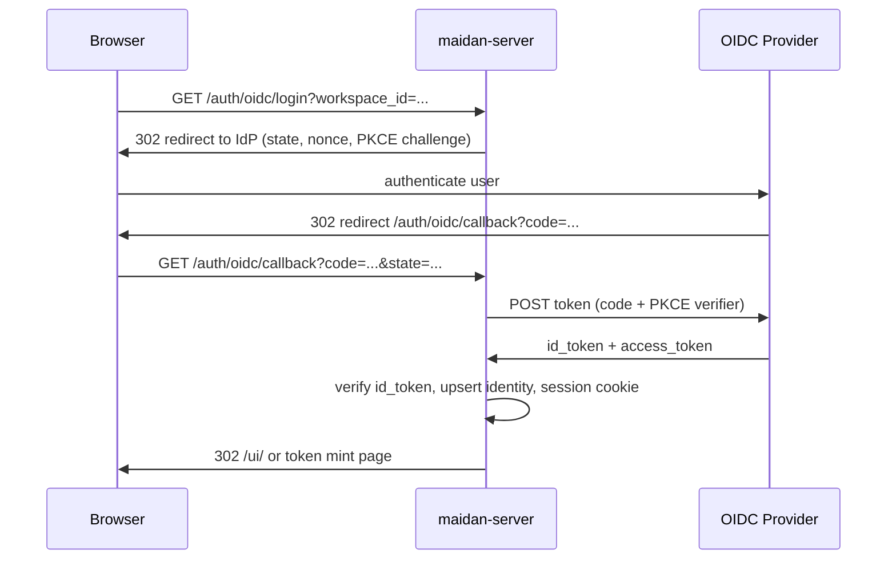

# OIDC human login (design spike, v1.4.2)

Status: **design only** — no runtime OIDC in `v1.4.0`. Full implementation is
targeted for **`v2.0.0`** (breaking auth/session surface). This document is the
spike deliverable for post-1.0 minor **1.4.2**.

Related: [[Threat-Model]], [[Production]], Cluster F auth (`v0.5.0`), `v1.4.1`
bootstrap gating.

## Problem

Maidan today authenticates **agents and automation** with long-lived **API
tokens** (SHA-256 hashed, capability-scoped, workspace-bound). That model fits
MCP clients and CI.

Operators and humans using **`/ui/`** (or future browser clients) need a
**short-lived, browser-safe** login path without pasting bearer secrets into
localStorage. Industry default: **OpenID Connect (OIDC)** against an IdP
(Google Workspace, Okta, Keycloak, Azure AD, etc.).

## Goals (v2.0.0 implementation)

| Goal | Notes |
|------|-------|
| Human login via OIDC | Map IdP `sub` (+ `iss`) to a `Member` with `kind: human`. |
| Issue Maidan API tokens after login | Browser session mints or displays a token once; agents keep using bearer tokens. |
| Workspace scoping unchanged | OIDC does not replace workspace-scoped capabilities. |
| Production-safe defaults | No implicit trust of `email` without verified claims; PKCE mandatory for public clients. |

## Non-goals

| Item | Rationale |
|------|-----------|
| Replace agent API tokens | Agents and MCP stay on bearer tokens. |
| Multi-tenant “orgs” above workspace | Deferred since Cluster F. |
| SAML 1.x / password store in Maidan | Use IdP; Maidan stores no passwords. |
| OIDC for federation peers | Peers keep peer bearer secrets (Cluster G). |
| SQLite-first OIDC session store | v2.0 targets Postgres; SQLite dev may use encrypted cookies only. |

## Current model (v1.4.x)

```text
Client --Authorization: Bearer <api_token>--> maidan-server
                      |
                      v
              resolve_bearer -> AuthContext { member_id, workspace_id, capabilities }
```

- Bootstrap: `POST /workspaces`, `POST /workspaces/:wid/members` when
  `MAIDAN_BOOTSTRAP=1` (or `AUTH_DISABLED=1` for tests).
- Token mint: `POST /workspaces/:wid/members/:mid/tokens` requires existing
  bearer with `token:admin`.
- Web UI (`/ui/`): no login; read-only tail against open routes when auth is off.

## Recommended approach: OIDC Authorization Code + PKCE

Use the **authorization code flow with PKCE** for browser and native clients.
Maidan acts as **OAuth 2.0 client** (relying party), not as an IdP.



### Why not implicit or resource-owner password?

- **Implicit** — deprecated; tokens exposed in front-channel.
- **ROPC** — discouraged; bypasses IdP MFA and central policy.
- **Client credentials** — for service accounts at the IdP, not human members.

## Session vs API token

Two layers, both needed:

| Layer | Lifetime | Use |
|-------|----------|-----|
| **Browser session** | Hours (configurable), HttpOnly cookie | Drive `/ui/`, call session-gated “operator” endpoints. |
| **API token** | Long-lived, revocable | MCP, scripts, agents — unchanged. |

**v2.0.0 default:** successful OIDC callback creates or links a `Member`, then
either (a) redirects to a one-time **token mint** page requiring an existing
`token:admin` holder, or (b) auto-mints a **narrow UI token** stored server-side
and referenced by session (no secret in JS). Option (b) is better UX for
first human in a workspace; gate it behind `MAIDAN_OIDC_AUTO_MINT=1` and
`token:admin`-equivalent bootstrap policy.

Rejected for v2.0: storing the IdP `access_token` and forwarding it on every
Maidan API call — couples Maidan to IdP TTL and complicates capability checks.

## Data model (sketch)

New migration (Postgres + SQLite for dev parity on identity table only):

```sql
-- maidan_oidc_identities
-- workspace_id, issuer (iss), subject (sub), member_id, email_claim (nullable),
-- created_at, last_login_at
-- UNIQUE (workspace_id, issuer, subject)
```

Optional `maidan_sessions` for server-side session rows:

```sql
-- id, member_id, workspace_id, expires_at, csrf_secret, created_at
```

**Member linking rules:**

1. First login with `(iss, sub)` in workspace → create `Member { kind: human }`
   or attach to pre-provisioned member if `MAIDAN_OIDC_LINK_EMAIL` matches a
   verified `email` claim.
2. Subsequent logins → same `member_id`.
3. No automatic cross-workspace identity — workspace remains the tenancy boundary.

## HTTP routes (v2.0.0)

| Method | Path | Auth | Purpose |
|--------|------|------|---------|
| GET | `/auth/oidc/login` | none | Start flow; query `workspace_id`, optional `return_to`. |
| GET | `/auth/oidc/callback` | none | Code exchange, set session cookie. |
| POST | `/auth/logout` | session | Clear session + optional IdP end-session redirect. |
| GET | `/auth/session` | session | JSON `{ member_id, workspace_id, expires_at }` for UI. |

Existing bearer routes unchanged. Session middleware runs **only** on routes
explicitly marked `session_or_bearer` (UI + operator helpers), not on MCP/A2A.

## Configuration

| Variable | Required | Purpose |
|----------|----------|---------|
| `MAIDAN_OIDC_ISSUER` | yes (when enabled) | Issuer URL (discovery `.well-known/openid-configuration`). |
| `MAIDAN_OIDC_CLIENT_ID` | yes | OAuth client id. |
| `MAIDAN_OIDC_CLIENT_SECRET` | confidential clients | Server-side code exchange. |
| `MAIDAN_OIDC_REDIRECT_URI` | yes | Must match IdP registration (e.g. `https://maidan.example/auth/oidc/callback`). |
| `MAIDAN_OIDC_SCOPES` | no | Default `openid profile email`. |
| `MAIDAN_OIDC_ENABLED` | no | `1` enables routes; default off. |
| `MAIDAN_SESSION_SECRET` | yes (when OIDC on) | Cookie signing / encryption key (32+ bytes). |
| `MAIDAN_SESSION_TTL_SECS` | no | Default `28800` (8h). |

Validate at boot: OIDC enabled ⇒ session secret set; disallow with
`AUTH_DISABLED` in production (same pattern as `MAIDAN_ENV=production`).

## Security notes

| Topic | Mitigation |
|-------|------------|
| CSRF on login | Random `state` in cookie/session, compare on callback. |
| Replay | `nonce` in id_token; reject if mismatch. |
| Token leakage | HttpOnly, `Secure`, `SameSite=Lax` session cookie; PKCE required. |
| Confused deputy | Bind `workspace_id` into `state`; callback refuses workspace drift. |
| Email trust | Treat `email` as display only unless IdP marks it verified (`email_verified`). |
| Session fixation | Rotate session id after successful login. |

Update [[Threat-Model]] T1/T3 when implemented: stolen session cookie ≈ stolen
API token for UI-scoped capabilities.

## MCP and WebSocket

| Surface | v2.0.0 plan |
|---------|-------------|
| MCP | **No OIDC** — clients continue `Authorization: Bearer`. Optional future: device code flow for desktop MCP. |
| WebSocket | **No OIDC on wire** — `SubscribeFrame.token` stays API token; UI may fetch token via session-gated endpoint. |
| `/ui/` | Session cookie + same-origin `fetch` to session-gated read APIs or short-lived WS token. |

## Implementation phases

| Phase | Release | Deliverable |
|-------|---------|---------------|
| **Spike** | `v1.4.0` doc (this file) | Routes, schema, env, security, defer decision. |
| **P1** | `v2.0.0` | `openidconnect` crate (or `oauth2` + discovery), login/callback/logout, session cookie, identity table. |
| **P2** | `v2.0.x` | UI login button, session-gated workspace list, WS token bridge. |
| **P3** | post-2.0 | Device code for MCP; SCIM/group → capability templates (optional). |

**Recommendation:** ship **P1 in `v2.0.0`** only after bootstrap + token flows are
documented for greenfield installs ([[Production]]). Do not add OIDC to `v1.4.0`
retro scope beyond this spike.

## Alternatives considered

| Alternative | Rejected because |
|-------------|------------------|
| API tokens only + external proxy auth | Pushes complexity to every deployment; no first-class member identity. |
| JWT passthrough (Maidan trusts IdP JWT on every request) | IdP capabilities ≠ Maidan capabilities; key rotation and workspace scope are harder. |
| Implement in `v1.4.0` | Breaks semver-stable auth surface; needs session cookies, new tables, UI — too large for a minor. |
| Defer doc to `v2.0.0` | Loses planning window before retro; 1.4.2 explicitly allows doc-only. |

## Open questions (for v2.0.0 kickoff)

1. **Auto-provision vs invite-only:** may any IdP user create a member in a
   workspace, or require pre-created member + email match?
2. **Per-workspace IdP:** single global issuer vs `workspace.oidc_issuer` column.
3. **Session store:** Postgres rows vs signed encrypted cookie (no server store).
4. **First human admin:** interaction with `MAIDAN_BOOTSTRAP` and `token:admin`.

## References

- [OAuth 2.0 for Browser-Based Apps (BCP)](https://datatracker.ietf.org/doc/html/draft-ietf-oauth-browser-based-apps)
- [OpenID Connect Core 1.0](https://openid.net/specs/openid-connect-core-1_0.html)
- Cluster F: [[Clusters/Cluster F]] — capability vocabulary and token mint.
