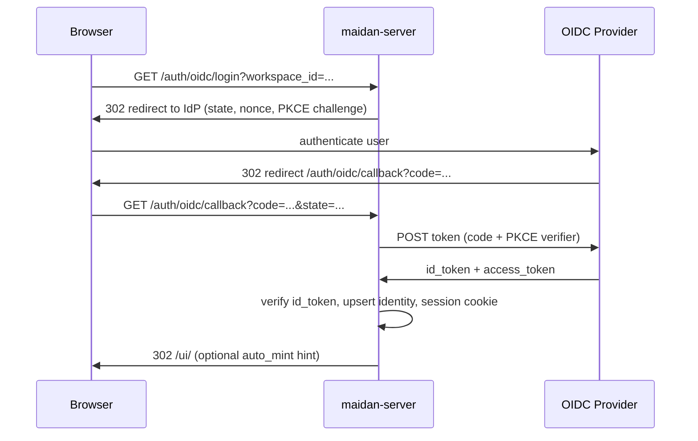

# OIDC human login

Status: **implemented**. This document describes the runtime behavior; deployment
routes and environment variables are also summarized in [Production](Production.md),
and the implementation history is in [Retros/Cluster 2.0](Retros/Cluster%202.0.md).

Since **`v406.0.0`**, required integration coverage also drives the production
runtime against a test-only loopback provider with real discovery, authorization,
token, ES256 JWKS, session, and provider-logout endpoints. Negative cases prove
that bad state, nonce, signature, audience, or issuer cannot issue a session.
The deterministic mock remains for fast handler tests; it is not production
configuration or the sole protocol evidence.

Related: [Threat model](Threat-Model.md), [Production](Production.md), Cluster F auth (`v0.5.0`), `v1.4.1`
bootstrap gating.

## Problem

Agents and automation authenticate with long-lived **API
tokens** (SHA-256 hashed, capability-scoped, workspace-bound). That model fits
MCP clients and CI.

People in a browser need a **short-lived, browser-safe** sign-in that does not
leave a bearer secret where page script can read it. OIDC against an IdP
(Google Workspace, Okta, Keycloak, Azure AD, etc.) is that path for `/ui/`:
the board's first-run card offers "Sign in with your identity provider" when
the server has one. A pasted token is the other path, and it too ends in an
HttpOnly session; the page does not keep the token.

## Implemented behavior

| Goal | Notes |
|------|-------|
| Human login via OIDC | Map IdP `sub` (+ `iss`) to a `Member` with `kind: human`. |
| First-admin token mint after login | The session endpoint may mint the first `token:admin` when the workspace has none; agents keep using bearer tokens. |
| Workspace scoping unchanged | OIDC does not replace workspace-scoped capabilities. |
| Production-safe defaults | No implicit trust of `email` without verified claims; PKCE mandatory for public clients. |

## Non-goals

| Item | Rationale |
|------|-----------|
| Replace agent API tokens | Agents and MCP stay on bearer tokens. |
| Multi-tenant “orgs” above workspace | Deferred since Cluster F. |
| SAML 1.x / password store in Maidan | Use IdP; Maidan stores no passwords. |
| OIDC for federation peers | Peers keep peer bearer secrets (Cluster G). |
| Encrypted-cookie-only OIDC session store | OIDC sessions are server-side rows in both Postgres and SQLite; the cookie carries a signed session id. |

## What signs in today

```text
Client --Authorization: Bearer <api_token>--> maidan-server
                      |
                      v
              resolve_bearer -> AuthContext { member_id, workspace_id, capabilities }
```

- Bootstrap: `POST /workspaces`, `POST /workspaces/:wid/members` when
  `MAIDAN_BOOTSTRAP=1` (or `AUTH_DISABLED=1` for tests).
- Token mint: `POST /workspaces/:wid/members/:mid/tokens` requires existing
  bearer with `token:admin`.
- Web UI (`/ui/`): a person signs in with the identity provider (authorization
  code and PKCE, below) or pastes a token. The page exchanges that token for an
  HttpOnly session (`POST /auth/session/from-token`) and does not keep it. With
  no `MAIDAN_SESSION_SECRET` there is no session, and the page keeps a pasted
  token in the tab only. There is no anonymous read-only board.

## Recommended approach: OIDC Authorization Code + PKCE

Use the **authorization code flow with PKCE** for browser and native clients.
Maidan acts as **OAuth 2.0 client** (relying party), not as an IdP.


```mermaid
sequenceDiagram
    participant Browser
    participant Maidan as maidan-server
    participant IdP as OIDC Provider

    Browser->>Maidan: GET /auth/oidc/login?workspace_id=...
    Maidan->>Browser: 302 redirect to IdP (state, nonce, PKCE challenge)
    Browser->>IdP: authenticate user
    IdP->>Browser: 302 redirect /auth/oidc/callback?code=...
    Browser->>Maidan: GET /auth/oidc/callback?code=...&state=...
    Maidan->>IdP: POST token (code + PKCE verifier)
    IdP->>Maidan: id_token + access_token
    Maidan->>Maidan: verify id_token, upsert identity, session cookie
    Maidan->>Browser: 302 /ui/ (optional auto_mint hint)
```

### Why not implicit or resource-owner password?

- **Implicit** — deprecated; tokens exposed in front-channel.
- **ROPC** — discouraged; bypasses IdP MFA and central policy.
- **Client credentials** — for service accounts at the IdP, not human members.

## Session vs API token

Two layers, both needed:

| Layer | Lifetime | Use |
|-------|----------|-----|
| **Browser session** | Hours (configurable), HttpOnly cookie | Drive `/ui/` and call session-gated UI routes. |
| **API token** | Long-lived, revocable | MCP, scripts, agents — unchanged. |

A successful OIDC callback creates or links a `Member` and creates a server-side
browser session. When enabled (the default), `POST /auth/session/mint` may mint
the first `token:admin` for the signed-in member's workspace; it refuses when an
active `token:admin` already exists. `MAIDAN_OIDC_AUTO_MINT=1` only adds an
`auto_mint=1` hint to the UI redirect when that mint is available; the UI then
performs the explicit mint request.

The callback does not store the IdP `access_token` or forward it on Maidan API
calls; Maidan authorizes later requests with its session or API-token model.

## Data model

Migration 0012 creates these tables in Postgres and SQLite:

```sql
-- maidan_oidc_identities
-- workspace_id, issuer (iss), subject (sub), member_id, email_claim (nullable),
-- created_at, last_login_at
-- UNIQUE (workspace_id, issuer, subject)
```

`maidan_sessions` stores server-side session rows:

```sql
-- id, member_id, workspace_id, api_token_id, expires_at, created_at
-- (api_token_id: set for a session made from a token; csrf_secret was never
-- read and was dropped in migration 0129)
```

**Member linking rules:**

1. First login with `(iss, sub)` in workspace → when auto-provisioning is enabled,
   create `Member { kind: human }`, or attach to a pre-provisioned member if
   `MAIDAN_OIDC_LINK_EMAIL` matches a verified `email` claim; otherwise reject
   an unprovisioned identity.
2. Subsequent logins → same `member_id`.
3. No automatic cross-workspace identity — workspace remains the tenancy boundary.

## HTTP routes

| Method | Path | Auth | Purpose |
|--------|------|------|---------|
| GET | `/auth/oidc/login` | none | Start flow; query `workspace_id`, optional `return_to`. |
| GET | `/auth/oidc/callback` | none | Code exchange, set session cookie. |
| POST | `/auth/logout` | session | Clear session + optional IdP end-session redirect. |
| GET | `/auth/session` | session | JSON `{ member_id, workspace_id, expires_at }` for UI. |
| POST | `/auth/session/mint` | OIDC session | Mint the first `token:admin` for the session's member when `MAIDAN_OIDC_FIRST_ADMIN` is not `0` and the workspace has no active `token:admin`. |

Existing bearer routes are unchanged. Session middleware is used on the session
routes and the `/ui/api` routes (and the UI WebSocket path); MCP and A2A remain
bearer-token surfaces.

## Configuration

OIDC is disabled unless `MAIDAN_OIDC_ENABLED=1`. When enabled, boot requires
`MAIDAN_SESSION_SECRET` and `MAIDAN_OIDC_REDIRECT_URI`; non-mock deployments
also require `MAIDAN_OIDC_ISSUER` and `MAIDAN_OIDC_CLIENT_ID`. The runtime
settings are:

| Variable | Required | Purpose |
|----------|----------|---------|
| `MAIDAN_OIDC_ENABLED` | no | `1` enables OIDC; default off. |
| `MAIDAN_OIDC_ISSUER` | non-mock OIDC | Issuer URL used for OpenID discovery. |
| `MAIDAN_OIDC_CLIENT_ID` | non-mock OIDC | OAuth client id. |
| `MAIDAN_OIDC_CLIENT_SECRET` | confidential clients | Optional server-side code-exchange secret. |
| `MAIDAN_OIDC_REDIRECT_URI` | OIDC | Registered callback, such as `https://maidan.example/auth/oidc/callback`. |
| `MAIDAN_OIDC_SCOPES` | no | Space-separated scopes; default `openid profile email`. |
| `MAIDAN_OIDC_MOCK` | no | Deterministic dev/CI provider; rejected with `MAIDAN_ENV=production`. |
| `MAIDAN_OIDC_AUTO_PROVISION` | no | `1` permits a new OIDC identity to create a human member; otherwise the identity must already be provisioned or linked. |
| `MAIDAN_OIDC_LINK_EMAIL` | no | `1` permits linking a verified email claim to an existing member handle. |
| `MAIDAN_OIDC_FIRST_ADMIN` | no | Default on; permits the first-admin session mint. Set `0` to disable. |
| `MAIDAN_OIDC_AUTO_MINT` | no | `1` adds the UI `auto_mint=1` hint when the workspace has no active `token:admin`; requires first-admin mint. |
| `MAIDAN_OIDC_PENDING_TTL_SECS` | no | Pending login lifetime (default `600`). |
| `MAIDAN_OIDC_POST_LOGOUT_REDIRECT_URI` | no | Registered redirect used when the provider exposes `end_session_endpoint`. |
| `MAIDAN_SESSION_SECRET` | OIDC | HMAC key for signed `maidan_session` cookies and resume tokens. |
| `MAIDAN_SESSION_TTL_SECS` | no | Browser session lifetime (default `28800`, 8 hours). |
| `MAIDAN_COOKIE_SECURE` | no | `1` adds `Secure` to session cookies; production also enables it. |

`MAIDAN_OIDC_MOCK=1` uses a deterministic callback path and must not be used in
production. For a real provider, boot performs discovery and retains the
provider's logout endpoint when one is advertised.

## Recipe: Keycloak

Keycloak is a self-hosted identity provider, so this recipe needs no outside
account. It signs people in to the console with the authorization code flow
and S256 PKCE. It was run end to end on 2026-10-08 with the Keycloak 26.8.0
distribution and a source-built Maidan with auth on;
`scripts/keycloak-oidc-smoke.sh` repeats that check.

**1. Start Keycloak with the realm.**
[`examples/keycloak/maidan-realm.json`](../examples/keycloak/maidan-realm.json)
creates the realm `maidan` with one client, `maidan`. The client is public,
because Maidan sends no client secret, and S256 PKCE is required. It offers the
code flow only: implicit flow and direct password grants are off, and the realm
has self-registration off. Its redirect URI is
`http://127.0.0.1:8080/auth/oidc/callback`, and its post-logout redirect is
`http://127.0.0.1:8080/ui/`. Change both to your instance's address before
importing the file.

```sh
# The distribution (Java 21), which is what the recipe was run with:
cp examples/keycloak/maidan-realm.json keycloak-26.8.0/data/import/
KC_BOOTSTRAP_ADMIN_USERNAME=admin KC_BOOTSTRAP_ADMIN_PASSWORD=... \
  keycloak-26.8.0/bin/kc.sh start-dev --http-host 127.0.0.1 --http-port 8081 --import-realm

# The same server as a container (not run for this recipe):
docker run --rm -p 127.0.0.1:8081:8080 \
  -e KC_BOOTSTRAP_ADMIN_USERNAME=admin -e KC_BOOTSTRAP_ADMIN_PASSWORD=... \
  -v "$PWD/examples/keycloak:/opt/keycloak/data/import:ro" \
  quay.io/keycloak/keycloak:26.8.0 start-dev --import-realm
```

`start-dev` is Keycloak's development mode: plain HTTP and an embedded
database. In production, run `kc.sh start` with a hostname, TLS and a real
database, set the realm's `sslRequired` to `all`, and use `https://` for
every URL below.

**2. Add the people.** Create each person in the realm in Keycloak's admin
console, or with `kcadm.sh`, giving them an email, a first name and a last
name, and mark the email verified. Keycloak 26 asks a user with no first or
last name to complete their profile on first sign-in.

```sh
# Sign the admin CLI in to the local server once; it asks for the admin password.
kcadm.sh config credentials --server http://127.0.0.1:8081 --realm master --user admin
kcadm.sh create users -r maidan -s username=grace -s email=grace@example.com \
  -s emailVerified=true -s enabled=true -s firstName=Grace -s lastName=Hopper
kcadm.sh set-password -r maidan --username grace --new-password ...
```

**3. Give each person a member.** Create the member through SCIM, with the
person's verified email as the handle. A `token:admin` bearer can do it. The
examples keep the bearer out of curl's arguments, where other local users
could read it, by passing it in a header file:

```sh
auth=$(mktemp) && trap 'rm -f "$auth"' EXIT     # mktemp makes it 0600
printf 'authorization: Bearer %s\n' "$ADMIN_TOKEN" >"$auth"
curl -sS -X POST "$MAIDAN_URL/scim/v2/Users" \
  -H @"$auth" -H 'content-type: application/scim+json' \
  -d '{"schemas":["urn:ietf:params:scim:schemas:core:2.0:User"],
       "userName":"grace@example.com","displayName":"Grace Hopper","active":true}'
```

With `MAIDAN_OIDC_LINK_EMAIL=1`, the person's first sign-in links their
Keycloak identity to that member, and only when Keycloak says the email is
verified. A user with no member is refused ("OIDC user is not provisioned in
this workspace"). Leave `MAIDAN_OIDC_AUTO_PROVISION` off. With it on, every
enabled user in the realm gets a member in the workspace on first sign-in.

**4. Point Maidan at the realm.** Export these in the shell that starts
the Maidan server, or set them in its service environment:

```sh
export MAIDAN_SESSION_SECRET=...                # 32 random bytes or more
export MAIDAN_OIDC_ENABLED=1
export MAIDAN_OIDC_ISSUER=http://127.0.0.1:8081/realms/maidan
export MAIDAN_OIDC_CLIENT_ID=maidan
export MAIDAN_OIDC_REDIRECT_URI=http://127.0.0.1:8080/auth/oidc/callback
export MAIDAN_OIDC_POST_LOGOUT_REDIRECT_URI=http://127.0.0.1:8080/ui/
export MAIDAN_OIDC_LINK_EMAIL=1
```

Boot runs discovery against the issuer, so Keycloak has to be up first. The
issuer must be exactly the address Keycloak reports for the realm, which is the
`issuer` in `/realms/maidan/.well-known/openid-configuration`. Once Maidan is
up, `GET /.well-known/maidan.json` reports `"oidc": true`, and the console's
first-run card offers "Sign in with your identity provider".

**5. Check it.** The smoke script signs in the way a browser does, with curl
and Keycloak's own login form. It checks the S256 challenge, the callback's
session cookie and that the session is a human member of the workspace:

```sh
MAIDAN_URL=http://127.0.0.1:8080 MAIDAN_WORKSPACE=<workspace id> \
KC_USERNAME=grace KC_PASSWORD=... ./scripts/keycloak-oidc-smoke.sh
```

**6. A token for the person's own MCP client.** A console session does not work
on MCP, which takes bearer tokens only. An admin mints the person a token of
their own, scoped to what the client needs and with an expiry. Pick the
expiry when you mint, here seven days out:

```sh
EXPIRES=$(date -u -d '+7 days' +%Y-%m-%dT%H:%M:%SZ)   # macOS: date -u -v+7d +%Y-%m-%dT%H:%M:%SZ
curl -sS -X POST "$MAIDAN_URL/workspaces/$WS/members/$MEMBER_ID/tokens" \
  -H @"$auth" -H 'content-type: application/json' \
  -d '{"label":"grace-mcp-client","capabilities":["workspace:read","message:post"],
       "expires_at":"'"$EXPIRES"'"}'
```

`whoami` with that token answers as the person's member with exactly those
capabilities. A tool that needs more is refused ("missing capability:
workspace:write"), and after `expires_at` the token gets a 401. Pasting the
token into an MCP client is the step an OAuth authorization server would
replace. That server is parked (Decisions, "The connected-apps program runs its
fast track without an authorization server").

## Security notes

| Topic | Mitigation |
|-------|------------|
| CSRF on login | Random, one-time `state` is stored with the pending login and consumed on callback. |
| Replay | `nonce` in id_token; reject if mismatch. |
| Token leakage | HttpOnly, `SameSite=Lax` session cookie; `Secure` in production; PKCE required. |
| Confused deputy | Bind `workspace_id` into `state`; callback refuses workspace drift. |
| Email trust | Use `email` for linking only when `email_verified` is true; auto-provision may use it for handle/display. |
| Session fixation | Create a new server-side session row after successful login. |

[Threat model](Threat-Model.md) T16/T17 cover trace redaction and the risks of a
stolen or cross-origin browser session.

## MCP and WebSocket

| Surface | Current behavior |
|---------|------------------|
| MCP | **No OIDC** — clients continue `Authorization: Bearer`. A device-code flow for MCP is future scope, not implemented here. |
| WebSocket | Bearer clients use `SubscribeFrame.token`; the UI may authenticate the handshake with its same-origin session cookie. |
| `/ui/` | Uses the session cookie with same-origin `fetch` to session-gated APIs and the WebSocket path. |

## Implementation status

OIDC human login is implemented: discovery, authorization-code + S256 PKCE,
token exchange, ID-token validation, workspace-bound identity linking or
provisioning, server-side sessions, browser logout, and the UI/session routes
are runtime behavior. The loopback integration coverage exercises discovery,
authorization, token exchange, ES256 JWKS validation, session creation, and
provider logout; invalid state, nonce, signature, audience, and issuer inputs
are rejected without issuing a session.

The only OIDC-related item called out as future scope here is a device-code flow
for MCP. MCP clients continue to use bearer tokens; this does not make human
OIDC login unfinished.

## Historical alternatives considered

| Alternative | Rejected because |
|-------------|------------------|
| API tokens only + external proxy auth | Pushes complexity to every deployment; no first-class member identity. |
| JWT passthrough (Maidan trusts IdP JWT on every request) | IdP capabilities ≠ Maidan capabilities; key rotation and workspace scope are harder. |
| Implement in `v1.4.0` | Breaks semver-stable auth surface; needs session cookies, new tables, UI — too large for a minor. |
| Defer doc to `v2.0.0` | Loses planning window before retro; 1.4.2 explicitly allows doc-only. |

## Current policy decisions

1. Auto-provisioning is controlled by `MAIDAN_OIDC_AUTO_PROVISION`; verified
   email linking is separately controlled by `MAIDAN_OIDC_LINK_EMAIL`.
2. The issuer and client are configured per server process; the pending login
   binds the selected `workspace_id` to its one-time state.
3. Sessions are server-side rows referenced by signed `maidan_session` cookies.
4. `POST /auth/session/mint` can create the first workspace `token:admin` only
   for an OIDC session and only while `MAIDAN_OIDC_FIRST_ADMIN` permits it.

## References

- [OAuth 2.0 for Browser-Based Apps (BCP)](https://datatracker.ietf.org/doc/html/draft-ietf-oauth-browser-based-apps)
- [OpenID Connect Core 1.0](https://openid.net/specs/openid-connect-core-1_0.html)
- Cluster F: [Clusters/Cluster F](Clusters/Cluster%20F.md) — capability vocabulary and token mint.
